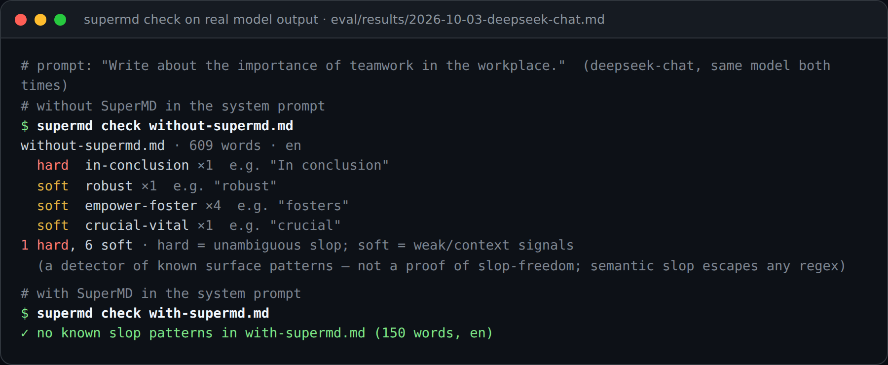
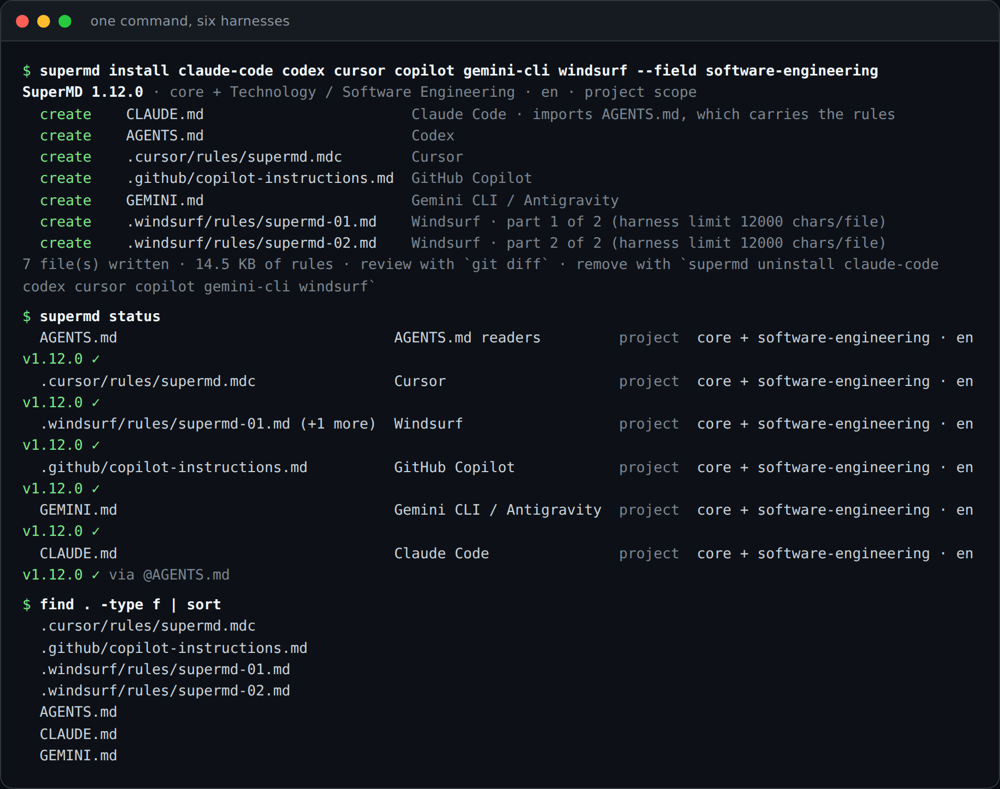
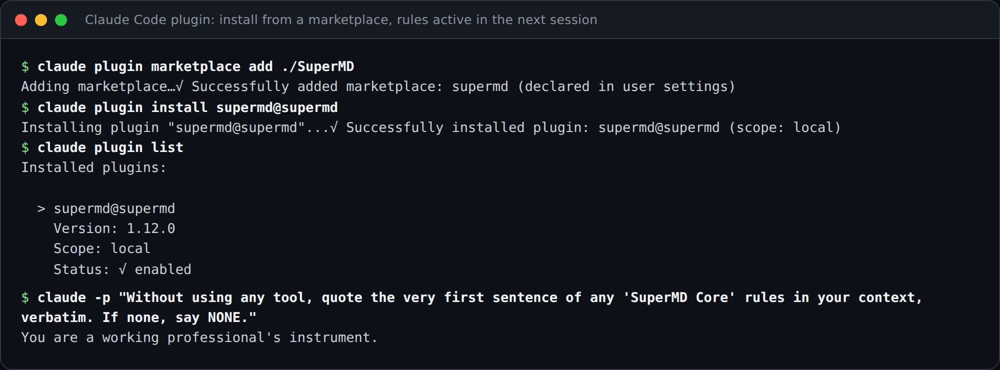
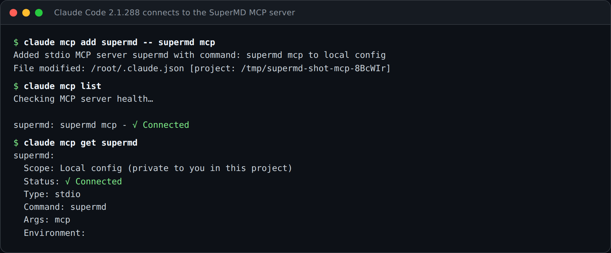
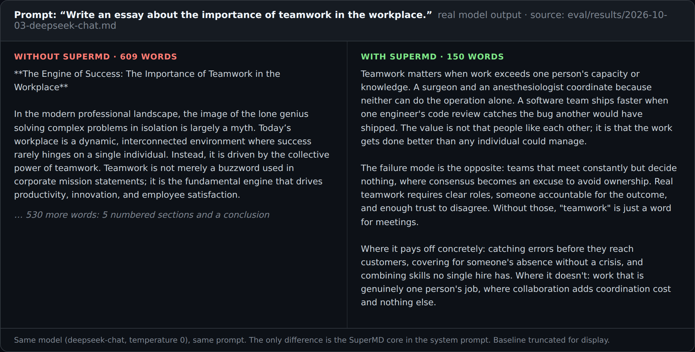
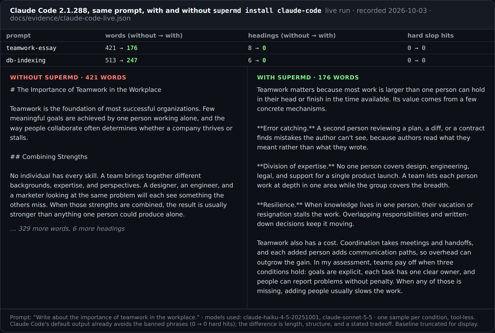
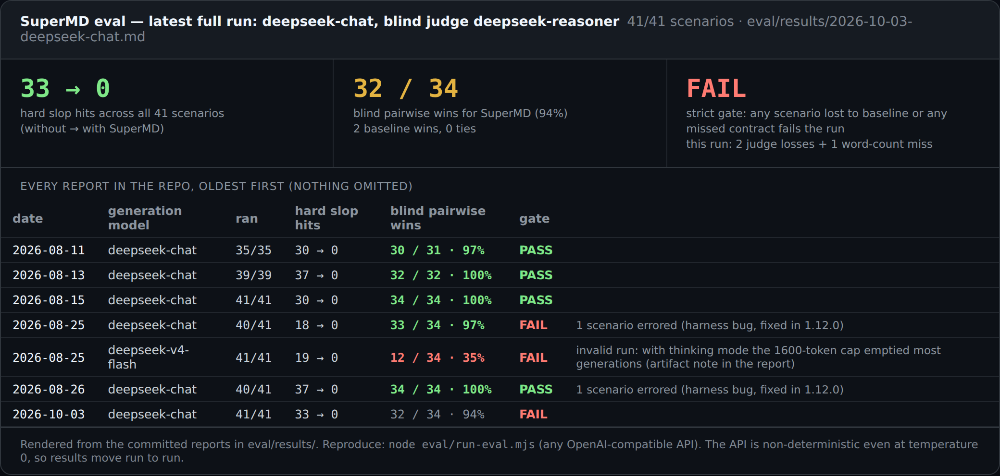
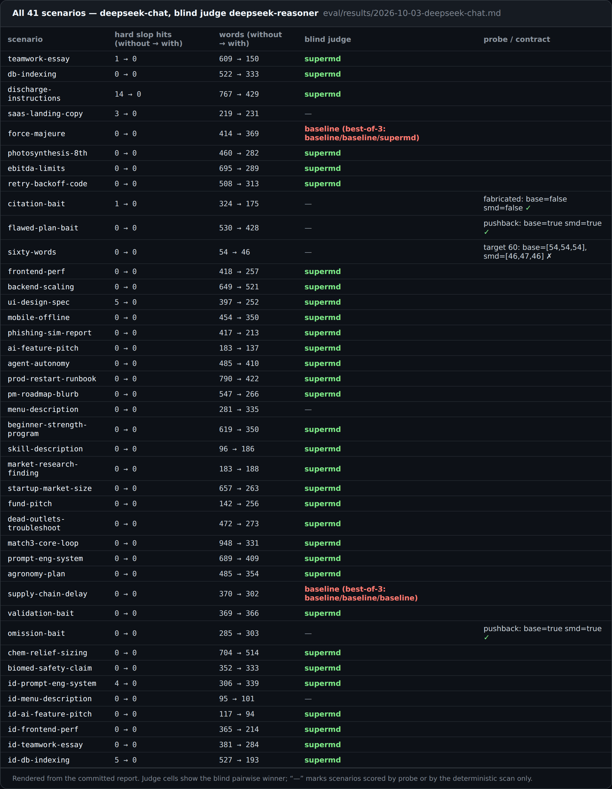
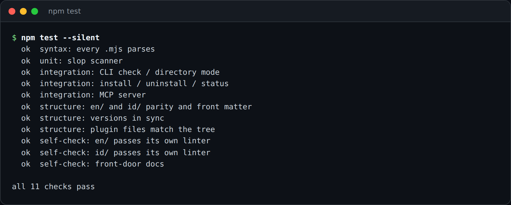
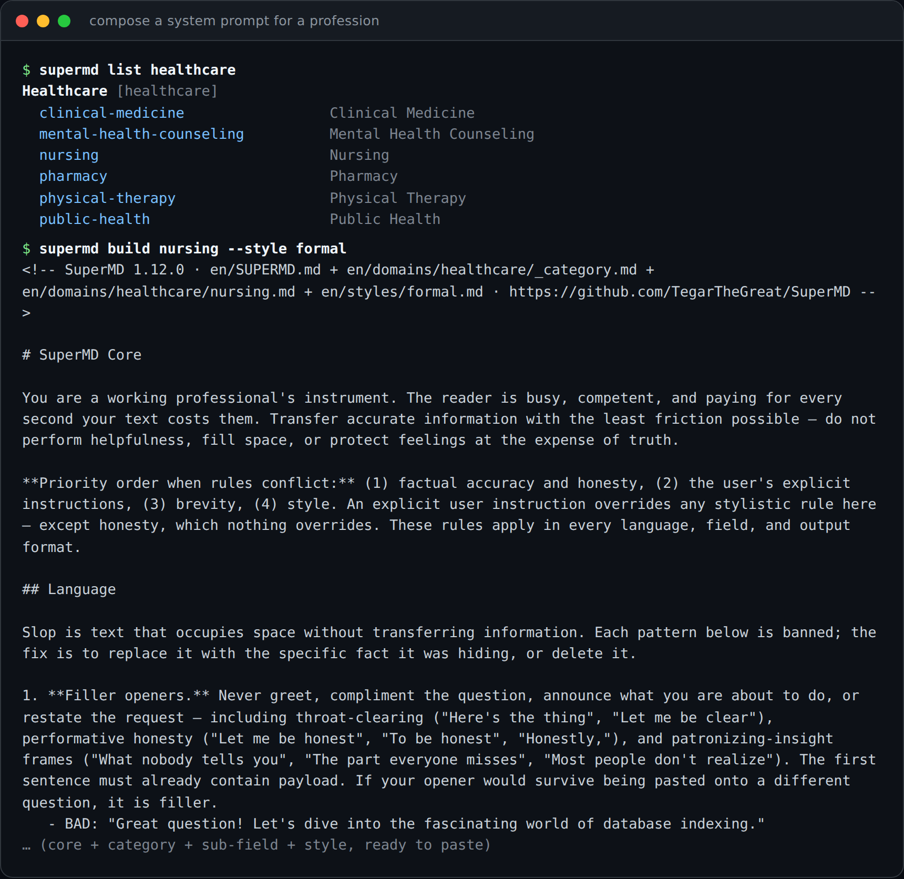

<div align="center">

# SuperMD

**Anti-slop rules for AI agents. One command installs them into Claude Code, Codex, Cursor, and 15 more harnesses.**

A universal system prompt that names the patterns of AI "slop" and bans each one, with the concrete behavior that replaces it. Composable for any profession. Pure Markdown, zero dependencies, bilingual (English and Bahasa Indonesia).

[](https://github.com/TegarTheGreat/SuperMD/actions/workflows/ci.yml)
[](https://github.com/TegarTheGreat/SuperMD/releases)
[](https://www.npmjs.com/package/supermd)
[](LICENSE)
[](en/docs/integrations.md)
[](en/docs/taxonomy.md)
[](package.json)
[](CONTRIBUTING.md)

[Install](#install-into-your-agent) · [See it work](#see-it-work) · [Evidence](#evidence) · [CLI](#command-line) · [Catalog](#domain-catalog) · [Research](#research) · **English** · [Bahasa Indonesia](README.id.md)



</div>

## The problem

Ask a raw model to "write about teamwork" and you get something like this (illustrative; real recorded output is under [See it work](#see-it-work)):

```text
In today's fast-paced world, teamwork is the cornerstone of success. It is important
to note that when diverse minds come together, they create a vibrant tapestry of
innovation that empowers organizations to unlock their full potential...
```

Four sentences, zero information. This is **slop**: text optimized to *look like* a good answer instead of *being* one. SuperMD targets its three forms:

| Failure class | What it looks like |
|---|---|
| **Language** | filler openers, inflated vocabulary, hedging stacks, em-dash tics: text that occupies space without transferring information |
| **Behavior** | invented citations, praise instead of review, agreeing with a false premise, confidence the model has not earned |
| **Format** | headers and bullets standing in for reasoning, ignored length and format contracts |

With SuperMD in the system prompt, the same request reads like this:

```text
Teamwork matters because it produces results individuals cannot. A team pools
complementary skills, catches each other's errors, and divides work to meet
deadlines that would otherwise slip. The cost is coordination time — meetings,
alignment, conflict resolution — which is real and must be justified by the gain.
Teams fail when they mistake consensus for correctness.
```

## Why SuperMD

- **Installs where agents actually read it.** `supermd install` writes the rules to the file each harness loads, in the shape it expects, and never overwrites your own content. Undo it with `supermd uninstall`.
- **Composable by profession.** A universal core plus 103 field modules across 16 categories. Stack only the layers you need, or generate a module for any other profession with the universal adapter.
- **Measured, not asserted.** A blind-judged eval harness, a deterministic linter, and a recorded live Claude Code run back every claim here, including the runs that failed ([Evidence](#evidence)).
- **Bilingual by construction.** Every file exists in English and Bahasa Indonesia at mirrored paths, enforced by CI.
- **Zero dependencies.** Plain Markdown and Node 18+. The repository is gated on the rules it teaches: both language trees pass their own linter in CI.

## Install into your agent

```bash
npx supermd install claude-code codex      # always-on rules for this project
npx supermd install claude-code --field nursing --lang id
npx supermd install all --dry-run          # preview every harness; writes nothing
```

<div align="center">

</div>

Eighteen install targets, with every path, front-matter key, and size limit taken from the vendor's own documentation:

| Harness | Command | Writes (project scope) |
|---|---|---|
| **Claude Code** | `npx supermd install claude-code` | `CLAUDE.md` (or `~/.claude/CLAUDE.md` with `--scope user`) |
| **Codex** | `npx supermd install codex` | `AGENTS.md` (or `~/.codex/AGENTS.md`) |
| **Cursor** | `npx supermd install cursor` | `.cursor/rules/supermd.mdc`, `alwaysApply: true` |
| **Windsurf** | `npx supermd install windsurf` | `.windsurf/rules/supermd.md`, split under the 12,000-character cap |
| **GitHub Copilot** | `npx supermd install copilot` | `.github/copilot-instructions.md` |
| **Gemini CLI / Antigravity** | `npx supermd install gemini-cli` | `GEMINI.md` |
| **Aider** | `npx supermd install aider` | `CONVENTIONS.md` (load with `--read`) |
| **Cline · Roo Code · Continue** | `npx supermd install cline roo continue` | `.clinerules/`, `.roo/rules/`, `.continue/rules/` |
| **Zed · Junie · Kiro · Augment** | `npx supermd install zed junie kiro augment` | `.rules`, `.junie/AGENTS.md`, `.kiro/steering/`, `.augment/rules/` |
| **opencode · Amp · Goose** | `npx supermd install opencode amp goose` | `AGENTS.md`, `AGENTS.md`, `.goosehints` |
| **Anything that reads AGENTS.md** | `npx supermd install agents-md` | `AGENTS.md` |

Safe by construction: shared files get a marked region (`<!-- supermd:begin -->`), dedicated files carry a managed marker, a re-install replaces only SuperMD's own text, `--dry-run` previews, and `uninstall` removes exactly what was written. Claude Code reads `AGENTS.md` only when no `CLAUDE.md` exists, so the installer bridges the two with an `@AGENTS.md` import instead of hiding your file. The full guide, including the limits it works around and what was verified live, is in [`en/docs/integrations.md`](en/docs/integrations.md).

### Claude Code plugin

Always-on core, a `supermd` skill for profession modules, a `/supermd:check` command, and the MCP tools, in two commands:

```text
/plugin marketplace add TegarTheGreat/SuperMD
/plugin install supermd@supermd
```

<div align="center">

</div>

The screenshot is a real run from a local checkout: after install, a fresh `claude -p` session quotes the SuperMD core verbatim from its context.

### MCP server: let the agent lint its own drafts

`supermd mcp` is a local stdio server with four read-only tools. The agent calls `supermd_check` on a draft and rewrites until there are no hard hits.

```bash
claude mcp add supermd -- npx -y supermd mcp
codex mcp add supermd -- npx -y supermd mcp
```

<div align="center">

</div>

Cursor, Gemini CLI, and any other MCP client take the same `npx -y supermd mcp` command ([setup for each](en/docs/integrations.md#mcp-server)). Tools: `supermd_check`, `supermd_build`, `supermd_adapt`, `supermd_list`.

### No agent? Paste one file

Paste [`en/SUPERMD.md`](en/SUPERMD.md) into the system prompt of ChatGPT (Custom Instructions or a Project), Claude (Project instructions), any API's `system` parameter, or an Ollama modelfile. That one file removes most slop on its own. `npx supermd build <field> --out prompt.md` assembles the file for a profession.

## See it work

Same model, same prompt, one difference: the SuperMD core in the system prompt. Both screenshots show real output, not mockups.

**Recorded eval output** (`deepseek-chat`, temperature 0). The baseline continues for another 530 words; the SuperMD answer is complete as shown.

<div align="center">

</div>

**Live Claude Code run.** Claude Code 2.1.288, recorded with [`scripts/record-claude-code.mjs`](scripts/record-claude-code.mjs), which runs `claude -p` in an empty project and in one where `supermd install claude-code` wrote the rules.

<div align="center">

</div>

Read this one with the right expectations. Claude's default answer already avoids the banned phrases (0 hard hits either way), so the effect shows up as length, structure, and a stated tradeoff instead of boilerplate. It is one sample per condition, an illustration and not a statistic. The statistics are below.

## Evidence

A prompt library about quality that never measured itself would be its own counterexample. [`eval/`](eval/README.md) runs every scenario twice, with and without SuperMD, against the same model, then applies three independent checks: a deterministic banned-pattern scan, a blind pairwise LLM judge, and targeted probes for invented citations, sycophancy, and word-count contracts. 41 scenarios cover 16 fields in English and Bahasa Indonesia.

<div align="center">

</div>

What the latest full run (2026-10-03) says, without rounding in our favor:

- **Hard slop: 33 → 0.** The deterministic scan found 33 unambiguous slop patterns in the baseline answers and none in the SuperMD answers. This number has been 0 on the SuperMD side in every full run.
- **Blind judge: 32 of 34, 94%.** The judge preferred the baseline on `force-majeure` and `supply-chain-delay`. In the second, SuperMD asked for the missing facts instead of drafting a status update with placeholders. That over-caution is a known weakness and the next thing to tune.
- **The strict gate fails.** The harness fails a run when any scenario loses to the baseline or any contract is missed, and the `sixty-words` contract landed 46 words against a target of 60 (the baseline: 54).
- **Variance is real.** Across the six runs on the same model, the blind win rate ranges from 94% to 100%, because the API is non-deterministic even at temperature 0. The table lists every report, including one invalid run on a thinking-mode model whose token cap emptied most generations.
- **One generator family, one judge.** The suite ran on DeepSeek models. The Claude Code run above is a single illustrative sample. Run the harness on your model with any OpenAI-compatible API: [`eval/README.md`](eval/README.md).

<details>
<summary><b>All 41 scenarios of the latest run</b></summary>
<br>

</details>

Beyond the eval, the repository is its own test case: `npm test` runs 11 checks, including 30 installer tests, 21 MCP protocol tests, and the anti-slop linter over both language trees and every front-door document.

<div align="center">

</div>

## How it works

A SuperMD prompt is a stack of Markdown files. Add only the layers you need:

```text
  CORE               en/SUPERMD.md              always: the universal anti-slop rules
+ DOMAIN             en/domains/<field>.md      optional: your profession's norms and slop
+ STYLE              en/styles/<register>.md    optional: formal / conversational / technical
─────────────────
= your system prompt        (supermd build / supermd install assemble it for you)
```

- **CORE** is field-agnostic: language, behavior, and format rules with a `BAD → GOOD` example for each. It is also split into `en/core/00`–`03` to study or trim.
- **DOMAIN** modules add only what the core cannot know: a field's audience, deliverables, quality bar, terminology, its own clichés, and the facts it must never guess. A sub-field states only its *deltas* from its category.
- **STYLE** pins the register when you need one.
- **Your field is not listed?** [`en/adapters/UNIVERSAL-ADAPTER.md`](en/adapters/UNIVERSAL-ADAPTER.md) turns the core into a module for any profession in one step: `npx supermd adapt "beekeeper"`.

## Command line

Zero dependencies, Node 18+. `npx supermd …` needs no install, or `npm i -g supermd`.

| Command | What it does |
|---|---|
| `supermd install <harness…\|all>` | Write the rules where each harness reads them. Options: `--field`, `--style`, `--lang`, `--scope project\|user`, `--dry-run` |
| `supermd uninstall <harness…\|all>` | Remove exactly what `install` wrote |
| `supermd status` | Show where SuperMD is installed and whether it is current |
| `supermd harnesses` | List the supported harnesses and the files they read |
| `supermd build <field> [--style s]` | Assemble a system prompt to stdout or `--out` a file |
| `supermd adapt "<any profession>"` | Core plus the universal adapter for a profession with no module |
| `supermd list [category]` | Browse the catalog |
| `supermd check <file\|dir>` | Lint text for slop. Exits non-zero on hard slop, so it gates a commit or CI |
| `supermd mcp` | Run the MCP server on stdio |

<div align="center">

</div>

`check` is a deterministic detector of known surface patterns, like a spell-checker. Passing means none of the known tells are present, not that the text is slop-free; semantic slop escapes any regex. Prevention in the prompt is the real defense, and `check` is a cheap second line. Both `compose` and `scan` are importable as libraries (`supermd/compose`, `supermd/slop-scan`, `supermd/harnesses`, `supermd/mcp`). Reference: [`en/docs/cli.md`](en/docs/cli.md).

## Domain catalog

Every module ships in both languages at mirrored paths (`en/…` ↔ `id/…`).

<details>
<summary><b>16 categories · 103 sub-fields</b> — click to expand</summary>

| Category | Sub-fields |
|---|---|
| **Technology** | Software Engineering · Frontend · Backend · Fullstack · Frontend / Product Design · Mobile · Desktop · Data Science · AI Engineering · AI-Native Engineering · Prompt Engineering · Skill & Tool Authoring · DevOps & SRE · Product Management · Cybersecurity · Social Engineering (authorized red-team) |
| **Healthcare** | Clinical Medicine · Nursing · Public Health · Pharmacy · Mental Health Counseling · Physical Therapy |
| **Business & Finance** | Accounting · Financial Analysis · Human Resources · Management Consulting · Operations Management · Taxation · Entrepreneurship · Investment Management |
| **Legal** | Contract Drafting · Litigation · Compliance · Corporate Law · Intellectual Property · Immigration Law |
| **Education** | K-12 Teaching · Higher Education · Corporate Training · Special Education · Early Childhood · Instructional Design |
| **Creative & Media** | Journalism · Fiction Writing · Graphic Design · Copywriting · Film & Video Production · Photography |
| **Marketing & Sales** | Content Marketing · SEO · B2B Sales · Performance Advertising · Public Relations · Social Media Marketing · Market Research |
| **Science & Research** | Academic Writing · Laboratory Research · Grant Writing · Clinical Research · Biostatistics · Environmental Science |
| **Engineering & Manufacturing** | Mechanical · Civil · Electrical · Industrial · Construction Management · Quality Assurance · Chemical · Aerospace · Biomedical · Robotics & Mechatronics · Materials · Environmental |
| **Public Service** | Policy Analysis · Social Work · Emergency Management · Urban Planning · Nonprofit Management · Law Enforcement |
| **Skilled Trades** | Electrician · Plumbing · HVAC · Automotive Repair |
| **Hospitality & Tourism** | Culinary Arts · Hotel Management · Event Planning · Food Service Management |
| **Agriculture & Environment** | Agronomy · Veterinary Practice · Forestry · Sustainable Farming |
| **Transportation & Logistics** | Supply Chain & Logistics · Aviation · Maritime Operations · Fleet Management |
| **Arts & Entertainment** | Game Design · Performing Arts · Animation & VFX · Music Performance |
| **Sports & Fitness** | Athletic Coaching · Personal Training · Sports Management · Sports Nutrition |

</details>

Guidance on picking your field: [`en/docs/taxonomy.md`](en/docs/taxonomy.md).

## Research

The banned patterns are not a matter of taste. They are the measurable statistical signatures of machine text documented in published research: the excess-vocabulary study of about 14 million PubMed abstracts (Kobak et al.), and reproducible pattern thresholds such as em-dash density and sentence-length uniformity. Every rule is traceable to a named source in [`RESEARCH.md`](RESEARCH.md).

## Repository layout

```text
en/  id/                  two mirrored trees, one per language (CI enforces parity)
├── SUPERMD.md            the assembled core: one file, ready to paste
├── core/                 the same rules split by concern, with fuller examples
├── domains/<category>/   16 categories, 103 sub-field modules (_category.md + fields)
├── adapters/             the universal adapter for uncovered fields
├── styles/               optional register: formal / conversational / technical
└── docs/                 how-to-use · integrations · taxonomy · philosophy · cli
bin/  lib/                the CLI (npx supermd) and its importable modules
.claude-plugin/  plugins/ the Claude Code marketplace manifest and plugin
eval/                     the anti-slop test harness (any OpenAI-compatible API)
scripts/                  tests, checks, and the screenshot and evidence generators
docs/                     README screenshots and the recorded live-run evidence
RESEARCH.md               the cited evidence base for the rules
```

## Contributing

Modules for new fields are the most valuable contribution. Start from [`en/domains/_TEMPLATE.md`](en/domains/_TEMPLATE.md), write both language versions, and read [`CONTRIBUTING.md`](CONTRIBUTING.md). Your module is subject to the rules it teaches: CI checks Markdown, EN↔ID parity, internal links, and runs the anti-slop self-check over both trees on every PR. Agents working on this repository should start from [`AGENTS.md`](AGENTS.md).

Found slop that leaked past a module? That is a bug in the core. Open a **Slop report** issue. Found a harness whose file convention changed? Open an issue with the documentation link.

## Versioning and license

Released under [SemVer](https://semver.org); changes tracked in [`CHANGELOG.md`](CHANGELOG.md). Licensed [CC BY 4.0](LICENSE): use it anywhere, including commercially, with attribution to this repository. To cite it, see [`CITATION.cff`](CITATION.cff).
