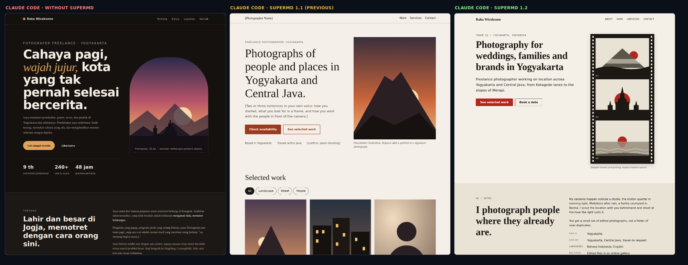
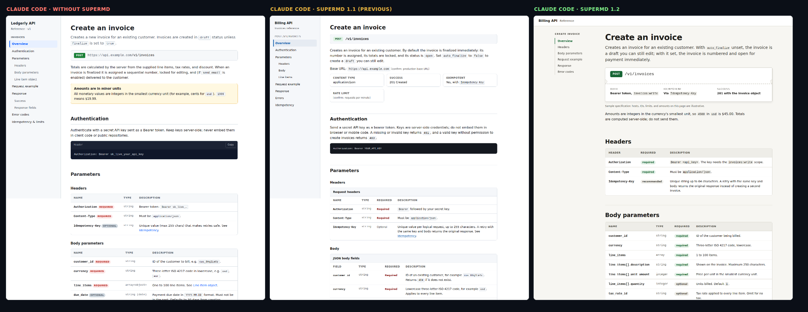

# Frontend check

Does SuperMD make generated interfaces better, or only plainer? This page records the answer, including the first answer, which was no. It is a small experiment, not a benchmark: reproduce it with [`scripts/frontend-experiment.mjs`](../../../scripts/frontend-experiment.mjs).





## Method

- **Prompts.** Eight single-file page prompts (no external assets) plus one React component prompt. `train`: a SaaS landing page, an on-call dashboard, a coffee-shop site, an account-settings form. These were used while writing the module. `test`: a meetup page and an orders admin table, held out for the first revision of the module and seen once afterwards. `test2`: a photographer's portfolio and an API reference page, written after `test` exposed what to tune and never used to tune.
- **Generators.** `deepseek-chat` at temperature 0, and Claude Code 2.1.288 (`claude -p`, no tools) with `supermd install claude-code --field frontend` having written the rules. One sample per cell.
- **Conditions.** `baseline` (no rules); `v11` (Frontend Engineering module 1.1.0, the first revision made in this release, commit `7e7b18b`); `v12` (the second revision, commit `cf29581`); `v13` (the final text of module 1.2.0, the one shipped).
- **Measures.** Counts from a headless Chromium render: emoji used as icons, CSS gradients, unsupported claims (a fixed phrase list in the script), `[confirm: …]` tokens, axe-core accessibility violations, horizontal overflow at 375px, focus styles, reduced-motion rules, landmarks, design-token use. And a **blind visual judge**: Claude is shown two rendered pages (first screen and full page, order randomized) and asked which a design lead would ship. Each pair is judged in both orders; only agreement counts as a win or loss, disagreement is a tie.

## Results

### Objective counts, prompts tuned on (train): 8 pages per condition

| measure | baseline | v11 | v12 | v13 |
|---|---|---|---|---|
| emoji icons | 19 | 0 | 0 | 0 |
| gradients | 6 | 1 | 0 | 2 |
| unsupported claims | 4 | 0 | 0 | 2 |
| `[confirm]` placeholders | 0 | 30 | 0 | 0 |
| axe violations | 16 | 1 | 2 | 2 |
| serious axe violations | 3 | 1 | 2 | 2 |
| overflow at 375px (pages) | 1 | 1 | 1 | 0 |
| focus style (pages) | 5 | 7 | 7 | 7 |
| reduced-motion rule (pages) | 2 | 4 | 7 | 8 |
| all four landmarks (pages) | 2 | 4 | 6 | 6 |
| design-token uses per page | 30 | 50 | 130 | 142 |
| words per page | 248 | 234 | 307 | 274 |

### Objective counts, prompts held out (test, test2): 8 pages per condition

| measure | baseline | v11 | v12 | v13 |
|---|---|---|---|---|
| emoji icons | 11 | 0 | 0 | 4 |
| gradients | 9 | 3 | 10 | 14 |
| unsupported claims | 0 | 0 | 0 | 0 |
| `[confirm]` placeholders | 0 | 58 | 0 | 0 |
| axe violations | 13 | 8 | 4 | 3 |
| serious axe violations | 5 | 5 | 4 | 3 |
| overflow at 375px (pages) | 0 | 3 | 1 | 1 |
| focus style (pages) | 5 | 7 | 8 | 8 |
| reduced-motion rule (pages) | 3 | 4 | 8 | 7 |
| all four landmarks (pages) | 2 | 3 | 6 | 5 |
| design-token uses per page | 33 | 41 | 153 | 134 |
| words per page | 357 | 344 | 412 | 346 |

### Blind visual judge (both orders must agree to count as a win or loss)

| subject | prompt set | against | wins | ties | losses |
|---|---|---|---|---|---|
| v11 | train | baseline | 2 | 3 | 3 |
| v12 | test | baseline | 0 | 2 | 2 |
| v12 | test | v11 | 2 | 1 | 1 |
| v12 | train | baseline | 8 | 0 | 0 |
| v12 | train | v11 | 8 | 0 | 0 |
| v13 | test | baseline | 2 | 1 | 1 |
| v13 | test2 | baseline | 3 | 0 | 1 |
| v13 | test2 | v11 | 4 | 0 | 0 |
| v13 | test2 | v12 | 1 | 2 | 1 |

Read the held-out rows, not the tuned-on rows. Revision `v12` won 8 of 8 against baseline on the prompts it was tuned on, then tied twice and lost twice on the first held-out round: the signature of tuning on the test.

## What happened

**The first revision was not better than no rules.** Against baseline, module 1.1.0 won 2, tied 3, and lost 3 of 8 blind comparisons. It cleared the emoji icons and cut accessibility violations, but it traded craft for caution. Generated pages had empty hero visuals, an orphaned fourth card in a three-column grid, thin footers, and prices and hours replaced by bracketed tokens: 88 `[confirm: …]` placeholders across its 16 pages, which the judge called "an unfinished template". That is the "frontend is not good" impression, and it was accurate.

**Module 1.2.0 fixes the cause.** It separates *sample content* (names, prices, menu items, chart data: allowed, marked once per page in small print) from *claims about the real world* (customer counts, testimonials, ratings, uptime: left out, never mocked). It adds a "Building UI from scratch" standard: design tokens first, a hero built from the product's own UI, balanced grids, a finished-state checklist, a single visual idea taken from the subject, and a size budget. On pages it had never seen, the final text won 3, tied 0, and lost 1 against baseline on the fresh round (4 of 4 against the previous module), and won 2, tied 1, lost 1 on the first held-out round. Objective counts on the eight held-out pages: axe violations 13 → 3, reduced-motion rules 3 → 7, all four landmarks 2 → 5, design-token use 33 → 134 per page, and no `[confirm]` placeholders.

**Where it still loses.**

- The one fresh-round loss is a real defect in the generated page: an inline-code style leaked into `pre` blocks, giving light text on a light background. axe-core flagged it (a serious color-contrast violation); the module's "compute contrast" line did not prevent it.
- DeepSeek is a weaker designer than Claude. It lost the meetup comparison on visual identity, and in the `v12` round the judge noted it repeated the "sample content" note across sections instead of marking it once.
- On the first held-out round, one DeepSeek page (`orders`, revision `v12`) hit the 8,000-token output cap mid-script and rendered an empty table. Richer pages risk truncation on models with small output limits, so the final text adds a 20 KB budget. That budget has not been tested separately.
- The judge is a model with its own taste. It rewarded distinct visual identity and completeness, and it can be wrong; both orders must agree before a result counts, and ties are common.

**Harness bugs found along the way, and fixed** (they would have biased the comparison): pages that fade sections in on scroll looked blank in full-page screenshots, penalizing the baseline pages that use them; a dashboard that shows skeletons for 1.2 seconds looked stuck; and an unclosed code fence from a truncated generation leaked a literal `` ```html `` into the rendered page. The two judgments on that truncated page (`orders`, DeepSeek, `v12`) were made before the last fix; the page is broken either way.

**What SuperMD does not do.** It does not choose a design for you, and the generic card grid still appears with and without it. It cannot verify a claim; it asks for sample content to be labeled, and a model that ignores the instruction ships the invention. Two generators and eight prompts say little about your stack. Run the script on yours.

## Files

- [`analysis.json`](analysis.json): every measure for every page. `judge-*.json`: each blind verdict, both orders, with the judge's one-sentence reason.
- [`outputs/`](outputs): raw generations for the held-out prompts, all four conditions, both generators. One change: a Stripe-documentation example key that DeepSeek reproduced in an API page (`docs.deepseek.v12.txt`) was replaced with `sk_live_REDACTED_EXAMPLE_KEY`, because GitHub push protection flags the pattern. It was never a real credential, and nothing else was edited.
- [`eval-frontend-subset.md`](eval-frontend-subset.md): the three frontend scenarios already in the eval suite, re-run on the final module: 3 of 3 blind wins, 0 hard hits.
- [`meta.json`](meta.json): when and how each batch was generated.

```bash
npm i --no-save playwright axe-core
node scripts/frontend-experiment.mjs generate out/ --set all --cond baseline,v13=WORKTREE
node scripts/frontend-experiment.mjs analyze out/ --set all
node scripts/frontend-experiment.mjs judge out/ --set test2 --subject v13 --against baseline
node scripts/frontend-experiment.mjs summary out/
```
