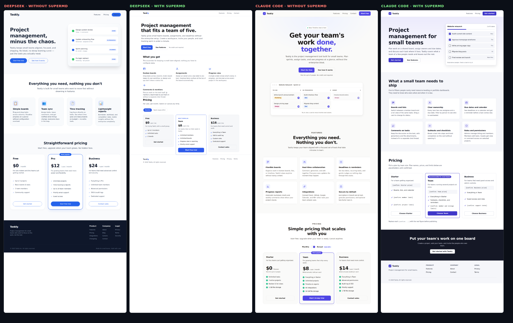

# Frontend check

Does SuperMD's anti-slop hold for frontend work? This is the recorded answer: two prompts, run with and without SuperMD (core plus the `frontend` module), on two generators. It is a small, countable experiment, not a benchmark. Reproduce it with [`scripts/frontend-experiment.mjs`](../../../scripts/frontend-experiment.mjs).

## Setup

- **Prompts.** `landing`: a single-file HTML landing page for Taskly, a fictional project management tool. `table`: a React `UserTable` component with sorting and pagination.
- **Generators.** `deepseek-chat` at temperature 0, and Claude Code 2.1.288 (`claude -p`, no tools, default model), where "with SuperMD" means `supermd install claude-code --field frontend` wrote the rules.
- **Two runs.** `run-1` used the Frontend Engineering module as shipped in 1.11.0 (module version 1.0.0). It exposed gaps, listed below. `run-2` used module version 1.1.0, which adds deltas for them. Raw outputs for every cell are in the run folders.
- **One sample per cell.** Differences of one count are noise. The baselines themselves moved between runs (for example `aria-sort` appeared in the run-2 baselines but not in run-1), which is the best estimate of that noise here.

## Results

### `run-1-module-1.0.0` — Frontend Engineering module 1.0.0, recorded 2026-10-03

| generator | condition | headline | hard slop | emoji icons | gradients | SVG icons | unsupported claims | prices | `[confirm]` placeholders |
|---|---|---|---|---|---|---|---|---|---|
| deepseek | without | Project management, minus the chaos. | 4 | 4 | 1 | 0 | 1 | 3 | 0 |
| deepseek | with | Project management that fits a team of five. | 0 | 0 | 0 | 0 | 1 | 3 | 0 |
| claude | without | Get work done, together. | 0 | 0 | 1 | 9 | 5 | 3 | 0 |
| claude | with | Project management that takes ten minutes to set up | 0 | 0 | 1 | 21 | 2 | 3 | 0 |

| generator | condition | states and accessibility hooks present | missing |
|---|---|---|---|
| deepseek | without | 8/10 | aria-sort, focus style |
| deepseek | with | 9/10 | focus style |
| claude | without | 8/10 | aria-sort, focus style |
| claude | with | 10/10 | — |

### `run-2-module-1.1.0` — Frontend Engineering module 1.1.0, recorded 2026-10-03

| generator | condition | headline | hard slop | emoji icons | gradients | SVG icons | unsupported claims | prices | `[confirm]` placeholders |
|---|---|---|---|---|---|---|---|---|---|
| deepseek | without | Project management, minus the chaos. | 4 | 4 | 1 | 0 | 0 | 3 | 0 |
| deepseek | with | Project management that fits a team of five. | 0 | 0 | 0 | 4 | 1 | 3 | 0 |
| claude | without | Get your team's work done, together. | 0 | 0 | 1 | 9 | 2 | 5 | 0 |
| claude | with | Project management for small teams | 0 | 0 | 1 | 22 | 0 | 0 | 8 |

| generator | condition | states and accessibility hooks present | missing |
|---|---|---|---|
| deepseek | without | 9/10 | focus style |
| deepseek | with | 10/10 | — |
| claude | without | 9/10 | focus style |
| claude | with | 10/10 | — |

Columns: *hard slop* is `supermd check` on the page's visible text; *emoji icons* excludes ©, ® and ™; *unsupported claims* counts phrases from a fixed list in the script ("no credit card", "free forever", "set up in minutes", "trusted by", …); *states and accessibility hooks* is keyword presence in the component code (loading, error, empty, disabled, `aria-sort`, `aria-label` or `role`, focus style, fetch cleanup, `res.ok` check, keyboard-operable controls), which shows what the code mentions and does not grade how well it works.

The frontend scenarios already in the eval suite (`frontend-perf`, `ui-design-spec`, `id-frontend-perf`) were re-run on module 1.1.0: 3 of 3 blind wins for SuperMD, 0 hard hits ([report](eval-frontend-subset.md)).

## What this showed

**It works on copy and on engineering rigor.** Without SuperMD, DeepSeek used four emoji as feature icons and headlined the page "Project management, minus the chaos"; with it, no emoji, no gradient, and a concrete headline. For the component, every run with SuperMD covered all ten states and hooks by module 1.1.0 (10/10), including the `aria-sort` and focus styling that the baselines sometimes missed.

**It had three gaps, found by this test.**

1. **The linter flagged `© 2026 Taskly` as hard slop.** Unicode classes ©, ® and ™ as pictographic, so any page footer failed `supermd check`. Fixed in 1.12.0, with a test.
2. **Invented product claims survived.** With module 1.0.0, Claude's headline became "Project management that takes ten minutes to set up", a claim nobody supplied. The baselines did the same ("Set up in under 5 minutes", "Join thousands of small teams"). Module 1.1.0 now says product claims come from the user or appear as labeled placeholders. Claude with 1.1.0 wrote "Project management for small teams" and 8 `[confirm: …]` placeholders for prices and limits, with a note to replace them before publishing. DeepSeek did not follow that rule: it still wrote three prices and "No credit card required".
3. **The core's "no decoration" rule bled into the interface.** With module 1.0.0, DeepSeek dropped icons entirely (0 emoji, 0 SVG), producing the plainest page of the four. Module 1.1.0 says the rule governs prose, not the UI, and DeepSeek then used 4 inline SVG icons. Its page is still sparser than the baseline's.

## What SuperMD does not do here

- It has no opinion on visual taste. The stock three-column feature grid and the centered hero appear with and without it; only the filler in them changes.
- It cannot verify a claim. It asks for placeholders; a generator that ignores the instruction (DeepSeek, above) ships the invented figure, and `supermd check` will not catch it, because a made-up price is not a regex.
- Two generators and two prompts say little about your stack. Run the script on yours.
